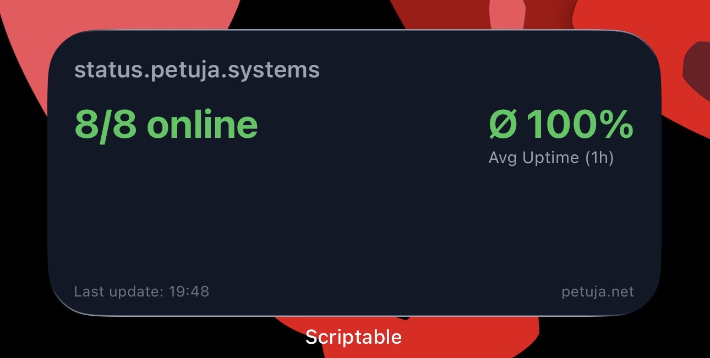
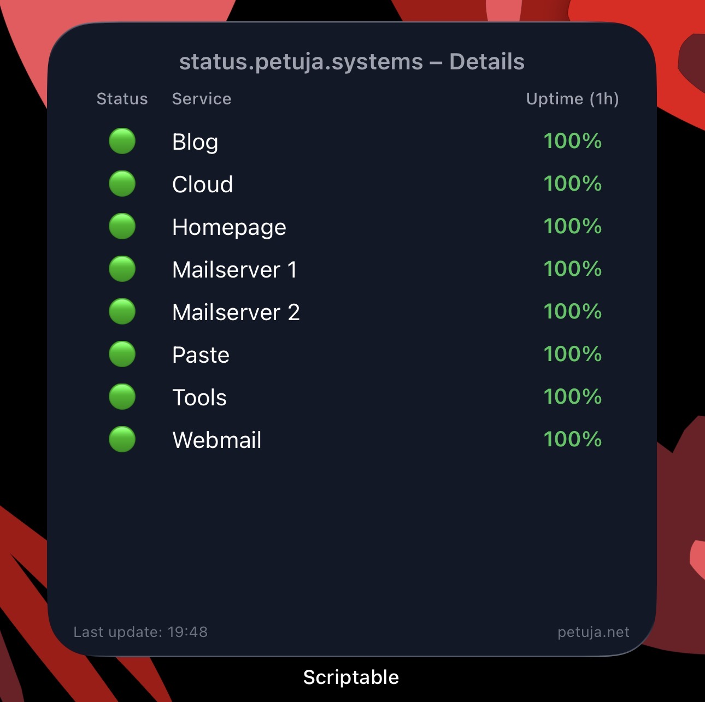

# ios-status-widget

This repository provides a Scriptable widget for iOS that displays the current service status from **status.petuja.systems**.  
The widget supports **all three sizes** (Small, Medium, Large) and adjusts its layout automatically.

## Features
- Displays how many services are online  
- Shows hourly uptime averages  
- Provides a detailed service list (large widget)  
- Clean design with color-coded status indicators  
- Works in all widget sizes without configuration

## Installation
1. Install **Scriptable** from the App Store  
2. Create a new script  
3. Paste the contents of `widget.js` into Scriptable  
4. Add a Scriptable widget to your home screen  
5. Select the script and you're done

## Screenshots
### Small  

### Medium  

### Large  

